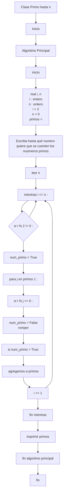
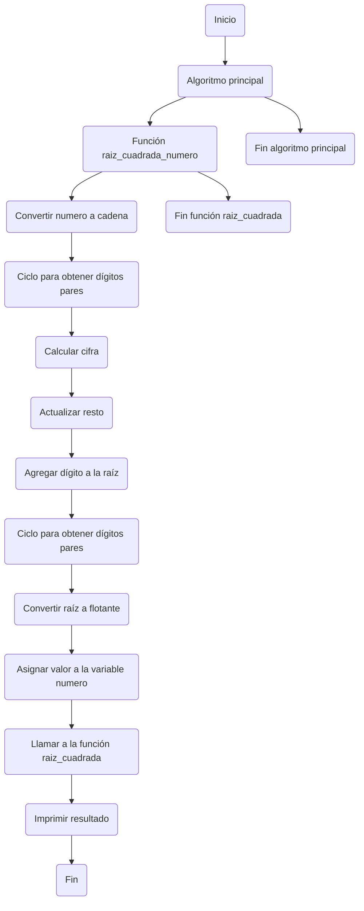

# números y números repo #3
`hi, again, everyone. this is my second repo, sincerely i hate pseudocoding, it's like quite boring and a little bit complicated, but well, it is what it is.`

##### *first part* 

###### so, let's start w/ pseudocode:

    clase primo hasta n 
    inicio 
      algoritmo principal 
      inicio 
        real i, n, 
        entero i, n, 
        i = 2
        n = 0 
        primos = [ ]
        imprimir “Escriba hasta qué número quiere que se cuenten los números primos”
        leer n
        mientras i ≤ n : 
          si i % 2 ≠ 0 : 
            num_primo = True
            para j en primos [1 :  ] :
          si i % j == 0 :
            num_primo = False
            romper
        si num_primo = True :
          agregamos a primos
        i += 1
        fin mientras
        imprimir (primos)
      fin algoritmo principal 
    fin
----

###### now, mermaid:

----

##### *second part*

##### let's start w/ pseudocode for this one:
    clase raíz cuadrada exacta
    inicio 
      algoritmo principal 
      inicio 
        real raiz_cuadrada(numero)
        raiz_cuadrada(numero) = 
        digitos = [ ]
        numero_cadena = str(numero)
        para i en rango (0, longitud(numero_str), 2) :
          añadir digitos a digitos(numero_str[i : i+2]
          raiz = " " 
          resto = 0
        para digito en digitos :
          cifra = 0
          mientras (cifra * cifra <= entero(digito) + resto:
            cifra += 1 
          resto = entero(digito) + resto) - cifra * cifra
          raiz += str(cifra)
        retornar float(raiz)
        numero = x
        raiz = raiz_cuadrada(numero)
        imprimir (`La raíz cuadrada de ${x} es ${raiz}`)
      fin algoritmo principal 
    fin

#### now, mermaid: 

